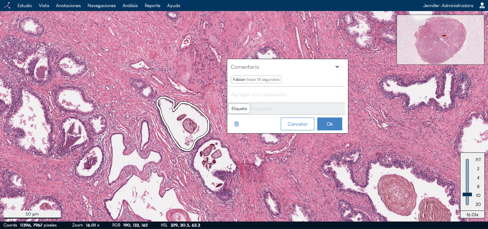

<div align="center">
<h1><strong>RedPat Viewer</strong></h1>
</div>

Sistema colaborativo para la visualización de imágenes de histopatología y su procesamiento con modelos de Inteligencia Artificial. Observe imágenes médicas en alta resolución. Agregue anotaciones, comentarios y etiquetas de forma sencilla y rápida. Navegue la imagen y guarde su recorrido e interacción. Para más detalles vea nuestra [demostración](http://177.93.51.13:8081/empatia/demo/viewer/1) en vivo.

<div align="center">

</div>

## Dependencias

[](https://docs.docker.com/get-docker/) [](https://nodejs.org/es/download/)

| Librería | Versión | Uso                         |
| -------- | ------- | --------------------------- |
| Docker   | 20.10.8 | Contenedor de aplicaciones  |
| NodeJS   | 16.13.0 | Instalación de dependencias |

## Instalación

Ubicarse en la raíz del proyecto **redpat-react-viewer** y construir la imagen del contenedor con el siguiente comando

```sh
 $ docker-compose build
```

Una vez terminado, ejecutar el siguiente comando para ejecutar el contenedor

```sh
 $ docker-compose up
 o
 $ docker-compose up -d   (ejecución en segundo plano)
```

La aplicación será desplegada en la dirección local http://localhost:3000.

El siguiente comando sirve para detener la ejecución del contenedor

```sh
 $ docker-compose down
```

## Autores

[](https://redpat.unillanos.edu.co/es/inicio) [](redpat@unillanos.edu.co)

Este proyecto está siendo desarrollado por investigadores de la [Universidad Nacional de Colombia](https://unal.edu.co/), y la [Universidad de los Llanos](https://www.unillanos.edu.co/), ambas Universidades públicas en Colombia.

Para mayor información consulte la [página web del proyecto](https://redpat.unillanos.edu.co/es/inicio). ¿Tiene alguna pregunta, sugerencia o realimentación? Háznoslas saber y envíanos un correo a redpat@unillanos.edu.co.

## Agradecimientos

Financiado por el proyecto BPIN 2019000100060 Implementación de una Red de Investigación, Desarrollo Tecnológico e Innovación en Patología Digital (**RedPat**) apoyada en tecnologías Industria 4.0 de recursos FCTeI de SGR, el cual fue aprobado por OCAD de FCTeI y MinCiencias.

## Licencia

[BSD 3-Clause](LICENSE) - Es libre de usar este código de cualquier manera. Pero conserve el archivo de licencia. No nos hacemos responsables si este código se usa para fines delictivos.
